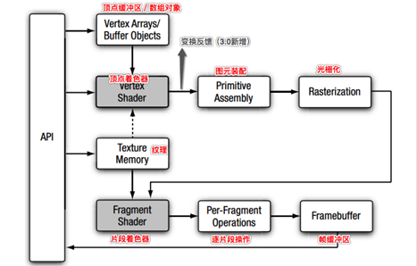
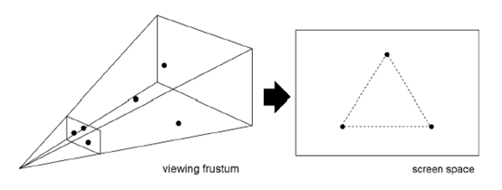
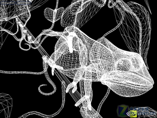
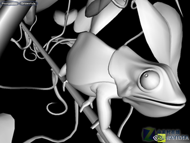

# OpenGL ES 学习代码笔记

## 学习博客 ：https://www.jianshu.com/nb/2135411

## 该博主的git代码仓库：https://github.com/loyinglin/LearnOpenGLES

### CPU 与 GPU 工作原理大致过程

#### UIBezierPath 、Core Graphics == Quartz 2D 、OpenGL

- **1、UIBezierPath 、( Core Graphics == Quartz 2D) 、OpenGL 关系**
    - UIBezierPath 封装了 Core Graphics

    - Core Graphics 封装了 Quartz 2D ，两框架是完全等价(即 Core Graphics 框架没有扩充新的内容)
        - **Quartz 2D 与 Quartz Extreme 组成了 Quartz 框架 **

    - Quartz 2D 绘图命令 转成 OpenGL 命令，然后再使用GPU实现绘图；Quartz Extreme 加速 GPU 绘图的速度

- **2、实现3D 或 2D 绘图的过程**
    - **注意：**3D绘图是从GPU工作开始

    - **(1) 使用 CPU 开始在线程中执行的任务**

        - 第0步：CPU 调度 主线程 创建一个**图开上下文(画板)**

        - 第1步：CPU 调度 主线程 执行 绘图代码( UIBezierPath 、Core Graphics 代码)

        - 第2步：**渲染时(即 提交绘图事务)**，CPU 根据 **绘制 路径 或 一张图片 进行 逻辑数据计算(这个过程对图片解码和格式转换)** 并 通过 Quartz 2D(核心绘图) 或 OpenGL 转换 **立体矢量几何图数据(由 圆数据，直线数据 等多边形构成) 与 对应状态数据(颜色描边还是填充，线宽 等)**进行一对一组装成一个**立体几何状态图的数组(即一帧所需的数据)** 存到 GPU **顶点化缓存区**寄存器中，告诉 GPU 需要开始图像处理与渲染工作
            - **图片解码**：把图片从PNG或JPEG等格式中解压出来，得到像素数据
            - **图片格式转换**: 如果GPU不支持这种颜色格式，CPU需要进行格式转换
                - 比如应用中有一些从网络下载的图片，而GPU恰好不支持这个格式，这就需要CPU预先进行格式转化。

        - **注意：所有的建模数据计算都是在 CPU 上完成的，例如 图像阴影建模 或 游戏场景切换 等**；所以这个过程也是有耗时的

    - **(2) GPU 处理3D和2D图像 与 像素点着色 过程**

        

        - 第3步：GPU 根据几何状态图数组数据，**高度并发** 从顶点缓存区取出**数组内的每个立体几何图的顶点位置集合** 进行复杂的**光源化计算** 转成 **2D平面几何图的顶点像素位置集合** 并且 把 该顶点像素位置集合 进行 **顶点着色**，这个过程就是**顶点化(Vertex Shader)**，把数组中所有几何状态图 顶点化后 **就构成了平面物体的轮廓**
            - **光源化处理立体几何顶点，这过程叫 顶点化**

            

            - **顶点着色**

            

        - 第4步：**纹理片贴图(即 计算图片像素点位置)** ；完成第3步后，就把 物体轮廓 上的点按一定规则连接起来，然后在上下文中形成的多边形区域内贴上纹理片，最终形成黑底白为画的物体
            - 先从纹理缓存中匹配，如果有则直接取出并贴上纹理片
            - 如果纹理缓存中没有，则需要从存贮器中进行耗时读出(从存贮器中读数据耗时不可避免)，那么GPU切换到另一个线程执行任务；
            - 等到 纹理从存贮器(它要么只读，要么只能写，这样避免读写冲突)中读取后，把纹理缓存，并等待GPU调用当前线程执行后面的任务

        

        - 第5步：**像素颜色属性计算**: 根据从CPU传过来的**立体几何图的多边形状态数据** 通过 PixelShader（像素着色器）获取**RGBA(即 颜色值 与 深度)** ；这个过程是与 前两步(功能是 计算像素的位置) 独立执行互不影响，可以在不同的线程并发执行
            - 非 Retain 屏 分辨率 [UIScreen mainScreen].scale = 1 ，对应 1个像素点
            - Retain 屏 分辨率 [UIScreen mainScreen].scale = 2 或 3，对应 4 或 9 个像素点

        - 第6步：将贴好的纹理图 与 计算好的像素属性 包装成 **像素的图元(即数据)** 交给 显卡进行 光栅化着色 ；

        - 第7步：由显卡的ROP（光栅化引擎，它是**可编程像素着色器(Fragment Shader)** ）完成像素点对应像素位置渲染对应的颜色；然后再进行搞锯齿化 等功能；然后进行下一个像素点的着色，等一幅图的所有像素点着色完成后 再把这些像素点拼成一幅图 形成 **一帧(即 一幅图)**；一系列操作后将 **一帧**添加到**显存帧缓冲区**
            - **iOS使用的是双帧缓冲机制**，即GPU 会预先着色好一帧放入一个缓冲区内（前帧缓存），让视频控制器读取，当下一帧着色好后，GPU 会直接把视频控制器的指针指向第二个缓冲器（后帧缓存）。当你视频控制器已经读完一帧，准备读下一帧的时候，GPU 会等待**显示器的 VSync 信号(即更新屏幕显图 信号)**发出后，前帧缓存和后帧缓存会瞬间切换，后帧缓存会变成新的**前帧缓存**，同时旧的前帧缓存会变成新的**后帧缓存**。

        - 第8步：**由 显卡 从 显存帧缓存区 拿到 一帧 并渲染到屏幕上**

        - 注意：
            - 0.GPU 绘图 是基于 OpenGL ES (它是 OpenGL 中绘图的那部分) 绘图 ；**GPU着色 分两个阶段：顶点化阶段 与 光栅化阶段**

            - 1.GPU的整个图像处理过程 没有占用 CPU 的资源，它们之间是协同工作的；**只有CPU发出绘图指令时GPU才开始工作**

            - 2.GPU 处理图像过程 是高度并发的;
                - 当纹理无法从缓存中读取到时，就会从内存中读出，正是因为内存中读取数据比较耗时，所以GPU就会切换到别外一个线程B去执行任务，直到线程A从内存中读取完纹理后，GPU再切换到线程A去执行接下来的步骤

            - 3.核心动画 是基于OpenGL 实现3D动画，

            - 4.一块标准的GPU主要包括2D Engine、3D Engine、VideoProcessing Engine、FSAA Engine、显存管理单元等。其中，3D运算中起决定作用的是3DEngine，这是现代3D显卡的灵魂，也是区别GPU等级的重要标志

            - 5.GPU 的逻辑数据计算能力 比 CPU 强很多倍；CPU 的控制能力 比 GPU 强

